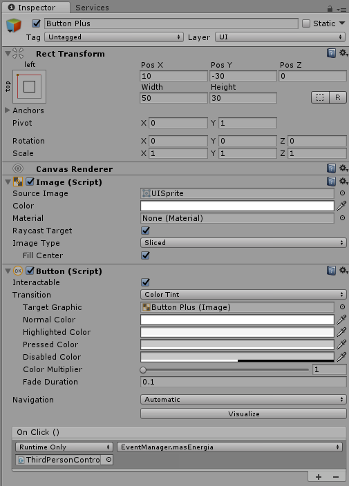
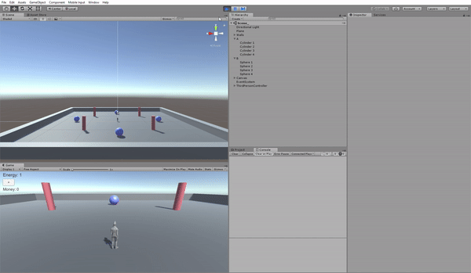
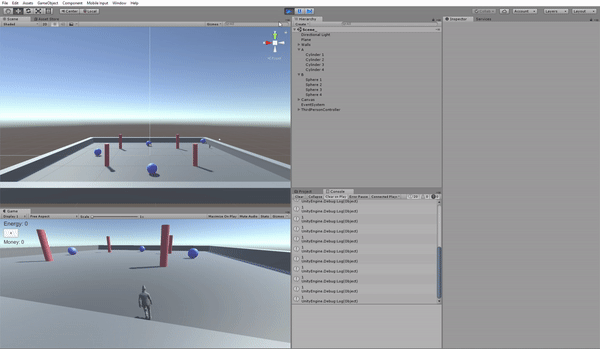
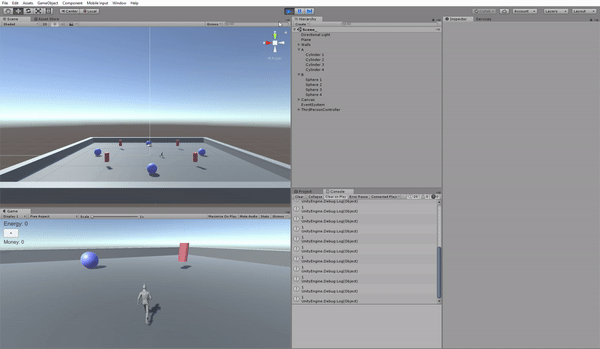

# Evaluación Mundos Virtuales

## Tipos de objetos

En la escena tendremos dos tipos de objetos:

- Tipo A: Cilindros que serán estáticos.
- Tipo B: Esferas que serán físicas.

Para que un GameObject sea físico tendrá que tener un componente rigidbody, por lo que las esferas lo tienen y los cilindros no.

## Requisitos

### Interfaz de usuario

Para la UI añadimos un botón que al pulsarlo aumenta el nivel de energía y decrece el dinero. Para ello hay que añadir en el inspector la función que debe ejecutarse al pulsarlo. En nuestro caso la función se encuentra en el script EventManager que lo tiene como componente el jugador porque es donde se almacena el nivel de energía y el dinero, y se llama masEnergia.

### Disparo A

Al presionar la tecla A se lleva acabo el tipo de disparo A que disminuye el nivel de energía y el tamaño de los objetos A. Para ello utilizamos un delegado al script EventManager, al que se le asigna una función en el script ObjetosA que lo tiene como componente todo los cilindros.

### Disparo B

Al presionar la tecla B se cambia el color de los objetos y aumenta el dinero que tiene el jugador. Para ello, como el requisito anterior, añadimos un delegado al script EventManager y le asignamos la función SwitchColor en el script CambiarColor, que lo tienen como componente todos los objetos que cambian de color.

### Colisión 

Cuando el jugador colisiona con alguna esfera (tipo B), los cilindros (tipo A) deben aumentar de tamaño. Para ello añadimos un delegado de nuevo a EventManager al que se le asignará la función que aumenta de tamaño del script ObjetosA.

